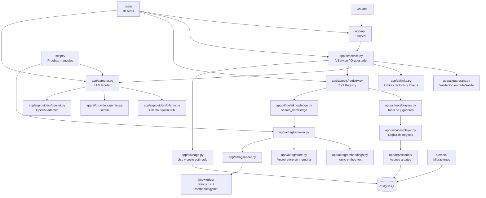

# Diamond IQ — Guía breve del proyecto y conceptos aprendidos

## 1. ¿Qué es Diamond IQ?

**Diamond IQ** es un proyecto de práctica orientado a combinar un backend tradicional con capacidades de IA generativa aplicadas a datos de béisbol.

Actualmente permite hacer preguntas en lenguaje natural y decidir de dónde debe obtenerse la respuesta:

- **Datos estructurados de jugadores y temporadas** → se consultan mediante tools conectadas a PostgreSQL.
- **Definiciones, metodología y documentación** → se consultan mediante RAG sobre la carpeta `knowledge/`.
- **El LLM** interpreta la pregunta, decide qué herramienta necesita, recibe el resultado y construye la respuesta final.
- **El router de LLMs** permite trabajar con distintos providers como Ollama y Gemini.
- El sistema incluye **límites, guardrails, seguimiento de uso, retries, timeouts y fallback**.

Ejemplos:

- `What is Mateo Rivera's Power rating?` → consulta datos estructurados.
- `What does Power mean in Diamond IQ?` → consulta la base de conocimiento con RAG.
- `What does Power mean, and what is Mateo Rivera's Power rating?` → combina RAG + PostgreSQL.

### Posibles mejoras

A futuro podrían añadirse:

- más documentación y fuentes para RAG;
- mejores evaluaciones automáticas de respuestas;
- observabilidad y métricas;
- políticas más sofisticadas de costos y selección de modelos;
- providers adicionales;
- cache de embeddings y respuestas;
- métricas de liga para contextualizar estadísticas;
- jobs programados;
- CI/CD más completo;
- despliegue cloud;
- herramientas de evaluación de temporadas o jugadores.

---

# 2. Flujo actual del proyecto

## Responsabilidad de las capas principales

### `app/api/`
Expone la aplicación al exterior mediante FastAPI. Recibe la petición HTTP y devuelve la respuesta pública.

### `app/ai/`
Contiene la arquitectura de IA: orquestación, providers, tools, RAG, límites, guardrails y seguimiento de uso.

### `app/ai/providers/`
Adapta las diferencias entre Ollama, Gemini y OpenAI para que el resto del sistema pueda tratarlos mediante un contrato común.

### `app/ai/tools/`
Define las capacidades concretas que el modelo puede solicitar. El LLM no accede directamente a Python, SQL o PostgreSQL.

### `app/ai/rag/`
Convierte documentación en información recuperable semánticamente mediante embeddings y similitud vectorial.

### `app/services/`
Contiene lógica de negocio independiente del LLM.

### `app/repositories/`
Se encarga del acceso a datos y mantiene los detalles de PostgreSQL alejados de las capas superiores.

### `app/db/`
Configuración, modelos y elementos relacionados con persistencia.

### `knowledge/`
Fuente documental de Diamond IQ para preguntas conceptuales.

### `alembic/`
Controla la evolución del esquema de base de datos mediante migraciones.

### `tests/`
Protege comportamiento esperado y regresiones. Actualmente el proyecto mantiene **91 tests en verde**.

### `scripts/`
Pruebas manuales y utilidades de diagnóstico, por ejemplo para providers o RAG.

---

# 3. Conceptos aprendidos

Los siguientes conceptos están ordenados dando prioridad a los que más pueden ayudarte en una entrevista relacionada con backend + IA generativa.

## 3.1 LLM — Large Language Model

Un LLM es un modelo capaz de interpretar y generar lenguaje.

En Diamond IQ usamos el LLM principalmente como **capa de razonamiento e interpretación**, no como fuente absoluta de datos.

El modelo puede entender:

> “What is Mateo Rivera's Power rating?”

pero no debería inventar el valor. Para obtenerlo debe consultar una tool.

**Idea importante:** el LLM interpreta; el backend controla los datos y operaciones reales.

## 3.2 Tool Calling / Function Calling

Tool Calling permite que el modelo solicite que nuestra aplicación ejecute una operación.

El modelo no ejecuta realmente la función. Solo produce algo equivalente a:

> “Necesito usar `get_player` con Mateo Rivera.”

Después, Diamond IQ valida la solicitud, ejecuta la operación y devuelve el resultado al modelo.

Ejemplo:

> Usuario: “What is Mateo Rivera's Power rating?”

Flujo:

1. LLM decide usar `get_player`.
2. Backend consulta PostgreSQL.
3. Resultado: Power = 98.
4. LLM redacta la respuesta.

Esto evita darle acceso directo al modelo a la base de datos.

## 3.3 Orquestación de LLMs

La orquestación es la lógica que coordina todos los pasos necesarios para completar una petición.

En Diamond IQ vive principalmente alrededor de `app/ai/service.py`.

El orquestador decide cuándo llamar al modelo, ejecutar tools, regresar resultados, continuar otra ronda, detener el proceso, aplicar límites y devolver la respuesta final.

Por ejemplo:

> LLM → tool → LLM → otra tool → LLM → respuesta.

No es simplemente “mandar un prompt”.

## 3.4 Agentes y comportamiento agentic

Un sistema agentic es aquel donde el modelo puede tomar decisiones sobre qué acciones realizar para alcanzar un objetivo.

Diamond IQ tiene un comportamiento **agentic sencillo**, porque el modelo puede decidir qué tools necesita y en qué orden.

No es una arquitectura multiagente compleja.

- **Tool Calling** = el modelo puede solicitar funciones.
- **Orquestación** = nuestro backend controla el ciclo.
- **Agente** = el sistema utiliza razonamiento + acciones para avanzar hacia un objetivo.

## 3.5 LLM Router

Un LLM Router decide qué provider utilizar.

En Diamond IQ tenemos una abstracción que permite trabajar con Ollama, Gemini y OpenAI.

Ejemplo:

> Provider primario: Ollama  
> Fallback: Gemini

Si Ollama tiene un fallo transitorio, el router puede decidir intentar otro provider.

## 3.6 Provider

Un provider es el servicio o sistema encargado de ejecutar el modelo.

Ejemplos:

- Ollama → modelo local.
- Gemini → Google.
- OpenAI → API de OpenAI.

Cada uno tiene formatos, errores y mecanismos distintos. La capa `app/ai/providers/` los adapta a un contrato común.

## 3.7 Retry

Un retry consiste en volver a intentar una operación cuando el fallo podría ser temporal.

Ejemplos: timeout, proveedor temporalmente no disponible o error 5xx.

No todos los errores deben reintentarse.

## 3.8 Timeout

Un timeout establece cuánto tiempo estamos dispuestos a esperar una operación.

Lo vimos con Ollama: un timeout demasiado corto hacía que el router saltara a Gemini aunque Ollama estuviera funcionando.

## 3.9 Fallback

Fallback significa utilizar una alternativa cuando la opción principal no está disponible.

- retry = volver a intentar el mismo provider;
- fallback = cambiar a otro provider.

Durante desarrollo deshabilitamos temporalmente el fallback para detectar claramente los problemas de Ollama.

## 3.10 Estado del provider

Algunos providers mantienen información propia entre diferentes pasos de una conversación.

Gemini, por ejemplo, puede utilizar identificadores de interacción.

Diamond IQ transporta ese estado sin intentar interpretarlo.

## 3.11 RAG — Retrieval-Augmented Generation

RAG permite que el modelo consulte información externa antes de responder.

En Diamond IQ lo usamos para documentación: significado de ratings, metodología y reglas de interpretación.

Ejemplo:

> “What does Power mean in Diamond IQ?”

El modelo usa `search_knowledge`, recupera `ratings.md` y responde usando ese contenido.

## 3.12 RAG vs Tool Calling

### Tool Calling
Permite ejecutar una capacidad.

Ejemplo: obtener el Power de Mateo Rivera desde PostgreSQL.

### RAG
Permite recuperar conocimiento documental relevante.

Ejemplo: explicar qué significa Power.

Diamond IQ puede combinar ambos en una misma pregunta.

## 3.13 Embeddings

Un embedding convierte texto en una representación numérica que permite comparar significado.

Así, una pregunta puede encontrar un documento relacionado aunque las palabras no sean idénticas.

Diamond IQ usa `nomic-embed-text` mediante Ollama.

## 3.14 Vector Store

Un vector store guarda embeddings para poder compararlos posteriormente.

Diamond IQ utiliza actualmente un store en memoria, suficiente para una base documental pequeña.

## 3.15 Similitud coseno

Es una forma de medir qué tan parecidos son dos vectores.

En Diamond IQ compara el embedding de la pregunta con los embeddings de los documentos para ordenar resultados relevantes.

## 3.16 Chunking

Chunking significa dividir documentos en fragmentos más pequeños.

Esto evita enviar documentación completa cuando solo una parte es relevante.

## 3.17 Grounding

Grounding significa hacer que la respuesta esté respaldada por una fuente concreta.

Lo vimos cuando RAG recuperó correctamente la definición de Power, pero Qwen añadió ejemplos que el documento no mencionaba. El retrieval era correcto, pero la respuesta no estaba completamente grounded.

## 3.18 Hallucination

Una alucinación ocurre cuando el modelo presenta información no respaldada como si fuera cierta.

Incluso una explicación razonable puede ser una alucinación si nuestra aplicación no tiene evidencia para sostenerla.

## 3.19 Guardrails

Los guardrails son reglas y controles alrededor del modelo.

No son “habilidades” del LLM.

En Diamond IQ se usan para validar input y output y para reforzar comportamientos seguros.

Un problema importante que resolvimos fue entender que una respuesta intermedia de Tool Calling puede tener contenido vacío. Eso no es un error: el modelo aún no terminó, solo está pidiendo ejecutar una tool.

## 3.20 Skills

Una Skill puede entenderse como una capacidad de más alto nivel que combina conocimiento, reglas y posiblemente varias tools.

No implementamos Skills formalmente.

Una posible futura sería:

> `evaluate_batter_season`

Podría combinar estadísticas, promedios de liga, reglas y una interpretación final.

- **Tool** → operación concreta.
- **Skill** → capacidad de negocio más completa.

## 3.21 Prompt Engineering

Prompt Engineering consiste en definir instrucciones que ayuden al modelo a comportarse correctamente.

En Diamond IQ el system prompt define reglas como usar tools para datos, RAG para documentación, no inventar estadísticas y no usar etiquetas cualitativas sin contexto.

## 3.22 System Prompt

El system prompt contiene instrucciones generales que gobiernan la conversación.

Funciona como una política interna del asistente, pero no sustituye controles reales de backend.

## 3.23 Structured Output y validación con schemas

Diamond IQ utiliza schemas para validar argumentos de tools antes de ejecutarlas.

Lo vimos cuando Qwen intentó `compare_players` con argumentos incorrectos. El backend detectó `invalid_arguments`, devolvió el error al modelo y este se corrigió usando `get_player`.

## 3.24 Errores recuperables vs errores internos

### Recuperables
El LLM puede corregirlos: argumentos inválidos, tool inexistente o resultado no encontrado.

### No recuperables
Suelen indicar un problema del sistema: base de datos caída, bug inesperado o error interno.

## 3.25 Whitelist de tools

El LLM únicamente puede utilizar tools registradas explícitamente.

No puede ejecutar SQL, comandos del sistema, funciones arbitrarias o imports dinámicos.

`app/ai/tools/registry.py` funciona como whitelist.

## 3.26 Separación entre comportamiento probabilístico y determinístico

Un LLM es probabilístico; el backend tradicional puede ser determinístico.

Por eso Diamond IQ deja al LLM interpretar lenguaje y redactar, mientras el backend consulta, valida, calcula y aplica reglas.

## 3.27 Tokens

Los modelos procesan texto en unidades llamadas tokens.

Una conversación con Tool Calling puede usar muchos más tokens porque cada ronda añade contexto, resultados y definiciones de tools.

## 3.28 Rate Limits y cuotas

Los proveedores suelen limitar uso por requests por minuto, tokens por minuto o requests por día.

Lo vimos con Gemini: una sola conversación agentic puede consumir varias requests.

## 3.29 Control de costos

Diamond IQ registra provider, modelo, tokens de entrada, tokens de salida y costo estimado.

Ollama local tiene costo API cero, aunque sigue existiendo costo de hardware y energía.

## 3.30 Límites de ejecución

Un agente sin límites podría entrar en ciclos.

Diamond IQ limita rondas de Tool Calling, número de tools y presupuesto total de tokens.

## 3.31 Observabilidad

Observabilidad significa poder entender qué ocurre dentro del sistema.

Durante desarrollo usamos logs temporales para ver provider, tools y fallback. En producción convendría logging estructurado, métricas y alertas.

## 3.32 MLOps / LLMOps

LLMOps aplica prácticas operativas a sistemas con LLMs: versiones de prompts, evaluación, costos, latencia, providers, trazabilidad, fallbacks y observabilidad.

Diamond IQ ya incorpora algunas de estas piezas.

## 3.33 RAG vs Fine-Tuning

### RAG
Aporta información al modelo en tiempo de ejecución.

### Fine-Tuning
Modifica el comportamiento aprendido mediante entrenamiento adicional.

Diamond IQ usa RAG porque necesita consultar conocimiento, no reentrenar el modelo.

## 3.34 MCP — Model Context Protocol

MCP es un protocolo pensado para conectar modelos con herramientas y fuentes externas mediante una interfaz estandarizada.

Diamond IQ no usa MCP actualmente.

Nuestro `ToolRegistry` resuelve internamente un problema parecido, pero de forma específica para el proyecto.

## 3.35 ADK — Agent Development Kit

Un Agent Development Kit ofrece componentes para construir agentes: tools, sesiones, memoria, workflows y observabilidad.

Diamond IQ construye muchas de estas ideas manualmente, lo cual ayuda a entender qué problema intenta resolver un framework de agentes.

---

# 4. Cómo explicar Diamond IQ en una entrevista

> Diamond IQ es un backend en FastAPI donde integré LLMs mediante una capa de providers y un router. El modelo no accede directamente a la base de datos; utiliza Tool Calling sobre un registry explícito de capacidades. Para datos estructurados consulta PostgreSQL y para documentación implementé un RAG pequeño con embeddings de Ollama y búsqueda por similitud. El orquestador soporta varias rondas de tools, límites, seguimiento de tokens, retries, fallback entre providers y guardrails. Lo construí de forma modular para poder cambiar el provider sin modificar la lógica de negocio.

Si te preguntan qué aprendiste:

> Lo principal fue entender que integrar un LLM en producción es mucho más que enviar prompts. Hay que controlar de dónde obtiene los datos, qué acciones puede ejecutar, cómo validar sus argumentos, cómo manejar errores, costos, límites, fallbacks y respuestas no respaldadas.

---

# 5. Ideas clave para recordar

1. **El LLM interpreta; el backend controla.**
2. **Tool Calling sirve para acciones y datos estructurados.**
3. **RAG sirve para recuperar conocimiento documental.**
4. **Guardrails controlan y validan; no son Skills.**
5. **Una Skill representa una capacidad de negocio más completa.**
6. **Retry vuelve a intentar; fallback cambia de provider.**
7. **Grounding significa responder con evidencia disponible.**
8. **Un agente combina razonamiento + acciones, pero debe tener límites.**
9. **Embeddings permiten buscar por significado, no solo por palabras.**
10. **Producción implica costos, cuotas, observabilidad, seguridad y evaluación, no solo prompts.**
